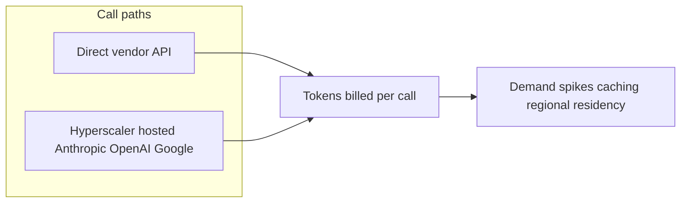
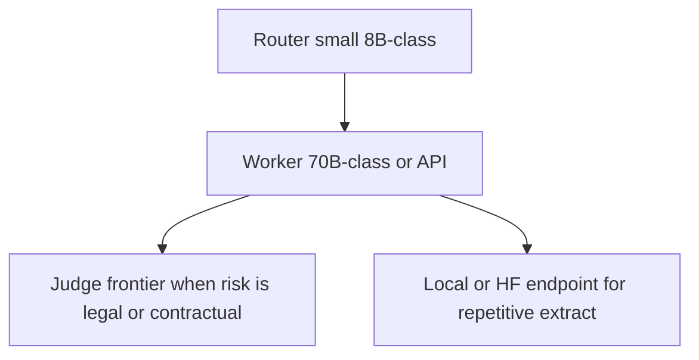
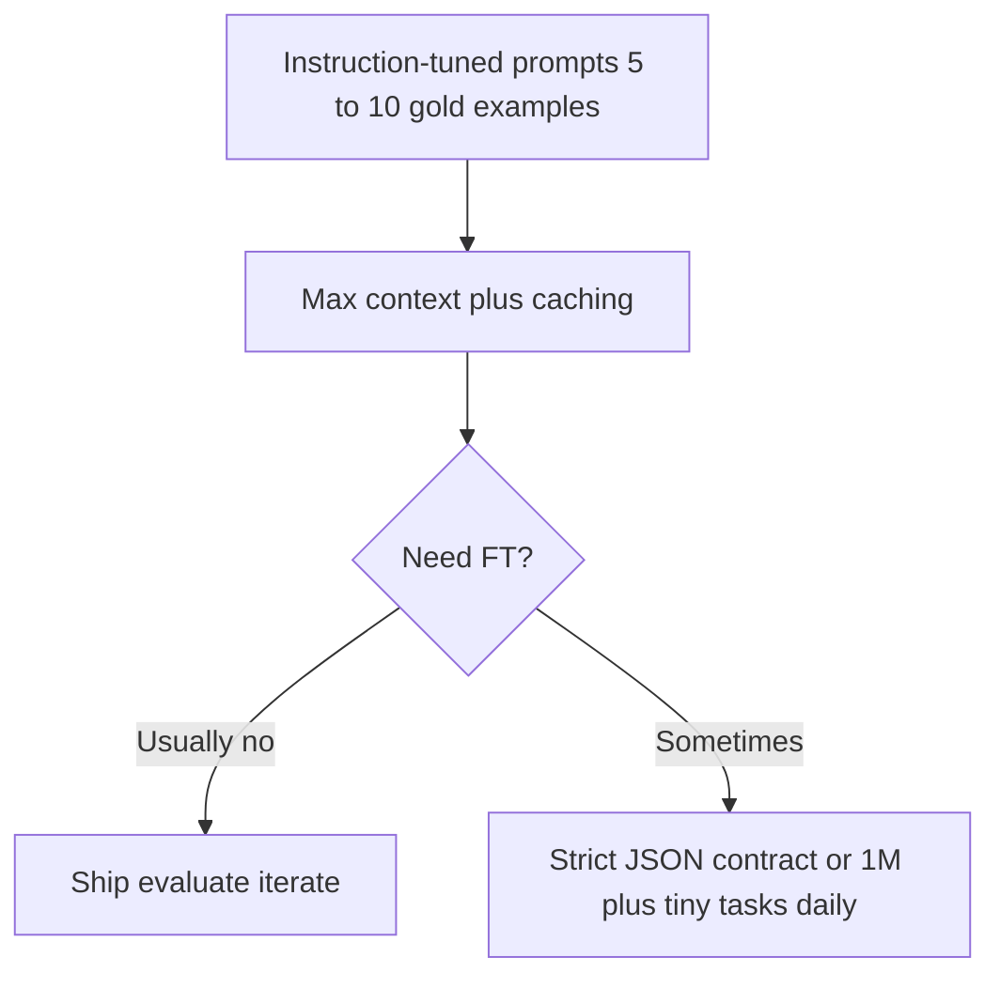

Part 1 · Intro

Construction · Agentic AI · Data insight

# Creating Robust Agentic AI Systems to Increase Data Insight Accessibility

Also known as: <em>Building Agentic Solutions for Construction</em>

Accessible insight · Analytics adoption · Production-grade agents

<!--
Part 1 intro timing: 0:00–0:10

Hook: Construction is decision-heavy and document-dense. In 2026 we build systems that work—not only chat.

Event alignment: tie “data insight accessibility” to analytics adoption in operations; preview that later we cover deterministic-enough behavior (patterns + evals), build vs buy, and measurable pilots—not hype.
-->

---

Part 1 · Practitioner

# The practitioner’s journey

**HPC foundation (~10 years):** shipping software products, taking them to market, and learning **hyperscale** reliability—customers across **manufacturing, life sciences, oil & gas, aerospace, defense, and automotive**. That shaped how I think about scalable systems.

**Cloud shift:** as HPC workloads moved cloudward, the work became **architecting cloud-native applications** and **native integrations**—the same discipline, different substrate.

**FlyPaper (CTO):** **BIM coordination**, **superintendent dailies**, and **pull planning** software grounded in the **Last Planner System**—**mobile and web** products built to meet crews **in the field**.

**Procore acquisition → Barton Malow:** helped stand up **data and automation**, built the **engineering team**, ran early **“what is AI / how do we use it?”** research, shipped internal **orchestration** work, and moved with the industry toward **MCP-style** tool contracts.

**Today:** building **agentic AI** for GC workflows—especially **preconstruction** and **submittals**—plus **competitive intelligence** for **BD and strategy** in AEC.

<!--
Part 1 closing: invite one concrete “ship story” if the room asks.
-->

---

Part 2 · Strategy 0:10–0:45

# Orchestration — the central nervous system

In 2026 the battleground is <strong>who controls context and workflow</strong>—not which foundation model “wins.”

<strong>Strategy:</strong> choose <strong>off-the-shelf</strong> when the problem already fits the vendor’s graph and speed beats differentiation. Choose <strong>hands-on</strong> when workflow, data, economics, or <strong>deep internal business knowledge</strong> must be yours—or you share the same packaged intelligence as everyone else.

LLM = engine · orchestration = transmission

### Off-the-shelf

<ul>
<li><strong>Databricks Agent Bricks</strong> + <strong>Unity Catalog</strong> — agents, tools, and lakehouse data in <strong>one</strong> governed loop (identity, MCP catalog, observability)</li>
<li><strong>Procore Helix</strong> (Assist, Agent Builder, <strong>Datagrid</strong> / connectors)—excellent <strong>in-platform</strong> loop; weak where edge lives in <strong>local LOB</strong> spreadsheets / systems outside the graph</li>
<li><strong>Glean</strong>, <strong>Bedrock Agents</strong> — “managed factory”: you land data; they run the thinking loop (COIs, standard retrieval)</li>
<li><strong>Autodesk Assistant</strong>, <strong>Claude Cowork</strong>, Zapier-class hubs — <strong>utility</strong> productivity; <strong>vendor tax</strong> / metering for speed—fine when the vendor boundary is acceptable</li>
</ul>

### Hands-on (power move)

<ul>
<li><strong>Workflow you encode</strong> — treat logic as a <strong>state machine</strong>, not a wall of prompt. Example: submittal — <strong>spec → extract → compare → if deviation &gt; threshold → human</strong>. Stack: <strong>LangGraph</strong> / <strong>LangChain</strong>, <strong>AWS Agent Core</strong>, <strong>Temporal</strong> + <strong>n8n</strong>/<strong>Windmill</strong> for durable glue</li>
<li><strong>Typed + multi-agent</strong> — <strong>Pydantic AI</strong> (ERP-safe I/O), <strong>CrewAI</strong> (roles and handoffs)</li>
<li><strong>Integration boundary</strong> — <strong>custom MCP</strong> (Python/Node) for wholesale APS / Procore APIs vs throttled vendor MCP; connect <strong>internal + third-party</strong> systems and <strong>lake/warehouse</strong> views so stakeholders can <strong>ask data</strong> without living in SQL—full story on the MCP slide</li>
<li><strong>Product surface</strong> — <strong>Vercel AI SDK</strong> + bespoke UI (e.g. superintendent: <strong>Check safety · Summarize daily · Order materials</strong>)—tools, not a thread. Heatmap / silent auditor patterns — <em>next slide</em></li>
<li><strong>Capacity under load</strong> — e.g. <strong>Bedrock provisioned throughput</strong> when crunch beats public rate limits (<em>inference slide</em>)</li>
</ul>

TierStrategyAdvantage

<strong>Off-the-shelf</strong>Buy the featureSpeed; low kit; vendor-shaped workflow

<strong>Hands-on</strong>Own workflow + stackMargin; moat; full context boundary

  Own the <strong>policy graph</strong> and <strong>context boundary</strong>—web, <strong>MCP</strong>, API, SDK are doors into the same graph
  Orchestration

<!--
Two-tier frame only: packaged vs hands-on (everything not off-the-shelf is the power move).

Off-the-shelf / Databricks: Agent Bricks + Unity Catalog = single control plane; pricing is consumption / DBU-style—every agent step hits the meter. Say it plainly: convenience vs. tax.

Procore: Helix is the intelligence layer (Assist, Agent Builder); Datagrid positions agentic AI across connectors—verify current marketing names before you quote slides verbatim.

Facilitator moat line: If you only use off-the-shelf, you share the same packaged intelligence as competitors. A hands-on custom MCP that wires 20 years of historical unit costs to a frontier model is a moat nobody can buy off the shelf.

Cross-ref: "Beyond the chatbot" slide expands artifact-first and role-specific surfaces.

Hands-on rationale (event staff echo): in-house orchestration is how you fold **proprietary process + historical context** into agents the vendor will never ship generic.

Inference slide owns full Anthropic vs Bedrock economics; this slide only teases provisioned throughput as "dedicated pipe under load."
-->

---

Part 2 · Strategy

# Beyond the chatbot

Role-appropriate surfaces — not “chat bad,” but “chat is one option”

**Conversational analytics:** when the surface <em>is</em> chat, **context and specificity** (what project, what time range, which source of truth) **directly shape** output quality—brief users once; don’t assume “the AI knows.”

**Field vs. trailer:** voice-forward chat can fit **hands-busy field** roles; a **project engineer** on an **iPad or laptop** in the trailer often needs **structured** views, approvals, and diff—not a thread.

**When chat is the wrong default:** if the job is “produce an artifact” (report, package, leveled bid), **ship the artifact UI**—a dashboard or wizard that **thinks**, instead of making people type prompts.

#### Labor study — product vs. chat

**Not only** a chatbot that “explains BLS.” **Ship** an interactive **labor study**—BLS (and peers) fused with your assumptions, **AI synthesis**, exportable narrative—so users manipulate the **report**, not the prompt box.

#### Submittals — distribution lists vs. experience

Classic **email + distribution lists** work until volume and revision churn win. A **unified web/mobile** submittal surface can **abstract AI** behind routing, redlines, and audit trails—**outcome-first**.

**Example — submittal reviewer:** drag a PDF; get **side-by-side redline** and citations—not a chat transcript.

### Philosophy

Make AI <strong>invisible</strong>: enrich the artifact people already owe—RFIs, packages, studies—not “another app to log into.”

Deliver <strong>formats teams already live in</strong>—not a universal “learn to prompt” tax.

<!--
Speaker: PE vs super vs foreman — three different “right” surfaces for the same company.

Event alignment: “conversational analytics” stays honest when retrieval scope, time window, and SoT are explicit—same theme as guardrails later.
-->

---

Part 2 · Strategy

# Vendor agents vs. rolling your own

MCP is one way to wire tools — the business question is <strong>who owns the boundary</strong>

**Vendor path:** Procore / Autodesk / others ship **agents, connectors, and “opinionated” flows**—fast to adopt, often **metered**, roadmap is **theirs**. You pay for the abstraction; it may not optimize for **your** margin.

**Build path:** **Custom integrations** (including **MCP servers**) across **internal systems and third-party platforms**—**APS**, **ERP** read models, **lake / warehouse** views—**your** auth, caching, pagination, and **policy**. Sometimes you can **beat** packaged assistants on **latency and unit economics**—sometimes not; **prototype both**.

**Decision lens:** **technical capability** and **strategic fit**; integration **surface area** (how many systems?), **compliance**, **rate limits**, and whether the vendor’s “happy path” matches your **WBS / CM** reality.

**Own the boundary** you cannot afford to rent: lineage, approvals, and where **context** is assembled.

  Pick vendor agents when the fit is real; build when the fit is strategic or the bill/risk is structural
  Integration

<!--
Drop single-vendor war stories unless cleared for the room; keep trade-off framing.

Event alignment: cross-enterprise connectivity = internal + third-party in one governed boundary; “ask data” without eroding trust is a product decision not a model pick.
-->

---

Part 2 · Strategy

# Inference, tokens, and scale

Where you run matters as much as which model

**Prototype vs. production:** direct **Anthropic / OpenAI** APIs for benching; **Bedrock / Azure OpenAI / Vertex** for procurement, guardrails, and **data residency**.

**Economics move:** Anthropic models run on **AWS**—list vs. **Bedrock** pricing **crosses over** over time as deals change. Re-benchmark **quarterly**; the “cheaper path” is not a constant.

**Tokens = capacity planning:** batch size, concurrency, **prompt caching** for stable corpora (spec books), and **back-pressure** when vendors throttle.

**Security story:** keep payloads in **your** boundary; enterprise agreements for **training** use—give IT one crisp sentence.

<!--
Event alignment: production gateways are where **instruction**, policy, and guardrails meet the model—same slide as economics; remind room “cheap API” ≠ “safe default.”
-->

---

Part 2 · Strategy

# Model selection — right engine, right hill

Models are stochastic—<strong>reliable systems</strong> come from <strong>router / worker / judge</strong>, schemas, and <strong>eval loops</strong>, not from pretending the LLM is a calculator.

Use the **smallest** reliable model per step — **tokens are margin**, and latency is trust.

**Hugging Face & self-host:** great for **exploration**, **air-gapped** constraints, and **high-volume** narrow tasks—know your **ops** cost, not just API list price.

**Anti-pattern:** “Claude for everything” is **using a haul truck to catch a mouse**—fun demos, expensive production.

---

Part 2 · Strategy

# The fine-tuning trap

**Before fine-tuning, exhaust:** ICL + **full context** (manuals, standards packs) with **caching** where available.

**Fine-tune when:** you need a **hard format contract** or **massive** repetitive micro-tasks where **latency/cost** dominates.

**Trust before weights:** **guardrails**, structured outputs, and **eval + reasoning loops** with human gates—**instruction** and ICL usually move accuracy more than fine-tune; don’t erode **stakeholder confidence** chasing novelty.

**Motto:** **context windows** first; **weights** are a secondary lever.

---
layout: default
class: tp-scenario-slide tp-scenario-slide--stacked
---

Part 3 · Workshop

# Scenario cards

<h3 class="tp-scenario-card-title">Group 1 — Silent submittal auditor</h3>

Problem Reviewers miss alternates buried in long vendor PDFs.

Task Agentic flow that flags mismatches against the <strong>master spec</strong> — <strong>without</strong> a chat-first UI.

<h3 class="tp-scenario-card-title">Group 2 — Bid leveling engine</h3>

Problem Twenty trade bids with different exclusions and scopes.

Task Use <strong>MCP</strong> to pull APS model or property data and normalize bids into a standard <strong>WBS</strong> view.

<h3 class="tp-scenario-card-title">Group 3 — Historical knowledge estimator</h3>

Problem Junior staff lack narrative memory of <strong>why</strong> a past job bled margin.

Task Tool that reads <strong>actuals</strong> from ERP via MCP to sanity-check a new estimate.

More workshop ideas — swap in for a future session or spare group

<h3 class="tp-scenario-card-title">Alternate — Invoice vs. contract</h3>

Problem Draws, pay apps, and vendor invoices drift from <strong>contract / SOV</strong> language—finance catches it late.

Task Agentic <strong>line-item reconciliation</strong> (invoice ↔ contract ↔ change orders) with an <strong>exceptions queue</strong> and citations—not a chat thread.

<h3 class="tp-scenario-card-title">Alternate — Data cleanup synthesis</h3>

Problem Exports are noisy: duplicate vendors, bad codes, inconsistent units—BI is downstream of garbage.

Task <strong>AI-assisted normalization</strong> (suggest mappings, cluster dupes) with <strong>human approval gates</strong>; ship clean dimensions to the warehouse.

<h3 class="tp-scenario-card-title">Alternate — AEC news → strategy brief</h3>

Problem BD and leadership drown in feeds; <strong>strategy memos</strong> go stale before anyone reads them.

Task <strong>Synthesize AEC news</strong> (plus filings, press, selected trade pubs) into a <strong>strategy document template</strong>—markets, competitors, risks—with <strong>citations</strong> and refresh hooks.

<!--
Assumptions: workshop outputs are POCs only—not legal, compliance, or warranty advice. Encourage identifying source of truth and data residency up front.

Alternates: use row 2 if you have six tables, a makeup session, or want variety—same rubric applies.

Event alignment: scenarios are stand-ins for **high-impact use cases**—push each group to name **one pilot metric** (hours, error rate, adoption) so AI investment stays defensible.
-->

---

Close · Debrief

# Critique rubric

After groups present — use this to score designs in ~2 minutes each. Favor ideas with a <strong>clear pilot metric</strong> (time saved, defect rate, adoption) so spend stays justified.

1. **Architecture:** router/worker/judge — or one monolithic call?

2. **UX:** chatbot by default, or a tailored surface?

3. **Data:** what is the **source of truth** and who can access it?

4. **Monday plan:** what is the **30-day pilot** (scope, metrics, owner)?

5. **Outcome:** what **measurable** result unlocks the next funding or scale gate?

<!--
Event alignment: rubric = continuous justification for AI—tie each design to a metric leadership can recognize.
-->

---
layout: center
---

# Final thought

Your job is not to be an AI **user**. It is to be a **practitioner**: build bridges, own context, and protect your company’s intelligence.

Data insight accessibility · AEC · Own the graph

  <a href="https://www.linkedin.com/in/ispyhumanfly/" target="_blank" rel="noopener noreferrer">https://www.linkedin.com/in/ispyhumanfly/</a>
  or email me at <a href="mailto:dan@thoughtpivot.com">dan@thoughtpivot.com</a>.

<!--
Part 4 close: invite one crisp share-out per group against the rubric; park vendor debates in “trade-offs” language.
-->
